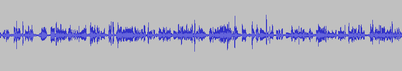
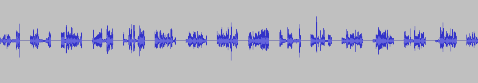

# Annoying Mute Line
A very simple [LADSPA](http://www.ladspa.org/) plugin that mutes audio for specified time at specified intervals. It takes two parameters:
- **Mute Interval:** The time in seconds to wait inbetween the mute attempts
- **Mute Length:** The time in seconds for how long the audio will be muted

For example if we call this filter on the audio below with `mute length` to be 1 second and `mute interval` to be 2 seconds:



It will result as:



## Compiling 

First you need to install LADSPA SDK:

```sh
apt install ladspa-sdk
```

Then compile with make:

```sh
make
```

## Installation

Run:

```sh
sudo make install
```

## Usage

You can use this plugin with any LADSPA host. If you haven't installed the plugin, you may need to add the directory that contains `mute.so` to `LADSPA_PATH`:

```sh
export LADSPA_PATH=.
```

### LADSPA applyplugin binary

This is probably the easiest way to test this binary:

```sh
applyplugin <input.wav> <output.wav> mute.so mute_n <mute_interval> <mute_length>
```

### Audacity

First go to `Effect`->`Add/Remove Plugins` and enable Annoying Mute Line. Then you can freely apply the plugin to any audio from the `Effect` menu.

### Pulseaudio

Pulseaudio also supports LADSPA plugins. For example to temper output audio, run:

```sh
pacmd load-module module-ladspa-sink sink_name=amute plugin=mute label=mute_n control=<mute interval>,<mute length>
pacmd set-default-sink amute
```

## Note
You can read a detailed explanation of the code [here](https://0x90.psaux.io/2020/12/07/How-To-Write-A-LADSPA-Plugin/).
